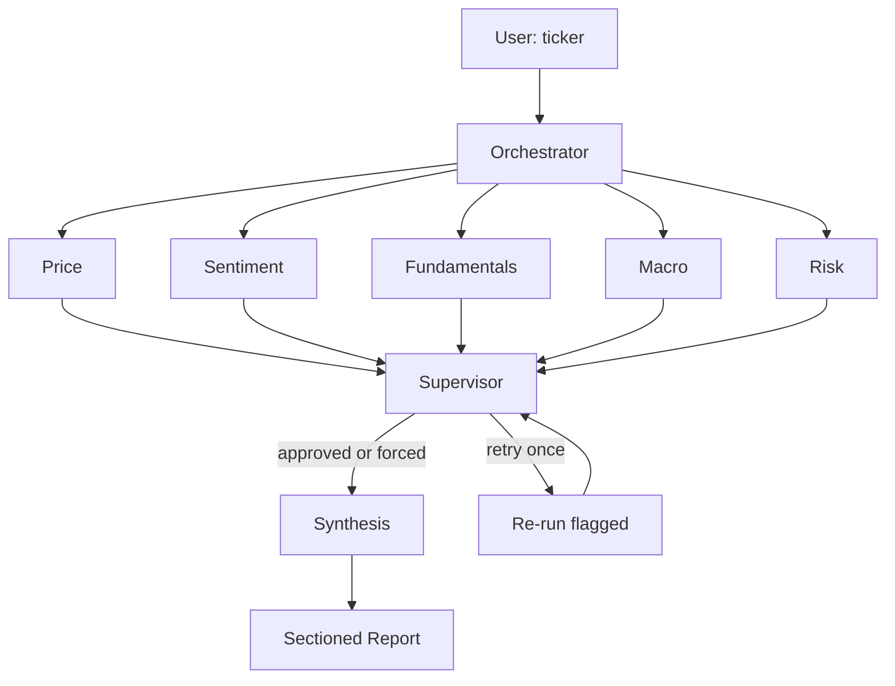

# MarketMind v2 — Multi-Agent Equity Analyst

A deterministic, structured equity analysis pipeline that runs five domain specialists
in parallel via LangGraph fan-out/fan-in and assembles a sectioned markdown report with
a verdict, conviction level, and confidence score.

## Live demo

Live on HF Space at https://huggingface.co/spaces/alanvaa/Autonomous_Financial_Analyst
(the Space slug retains the v1 name; the app inside is v2).
BYO-key model — paste your Anthropic and Tavily keys in the collapsible panel; keys are
session-scoped and never visible to other users.

## What it does

Enter a ticker. The orchestrator validates it, resolves the SEC CIK, and fans out to
five specialist agents that run in a single LangGraph superstep (parallel). A supervisor
performs light QA — checking for missing data, contradictions, and short sections — and
may request at most one retry round for flagged agents. After the supervisor approves
(or forces synthesis after one retry), a synthesis layer assembles a sectioned markdown
report containing a labeled verdict (e.g. "Strong Buy"), conviction, and confidence score.

## Architecture



## Specialists

| Specialist | Data source | What it analyzes |
|---|---|---|
| **Price** | yfinance 90-day OHLC | RSI(14), MACD(12/26/9), Bollinger %B, 7/30/90-day price change |
| **Sentiment** | Tavily (last 7 days) | News headline sentiment, top drivers, 3–5 cited headlines |
| **Fundamentals** | SEC EDGAR 10-Q + 10-K (raw requests + BeautifulSoup) | Revenue trend, margins, balance-sheet health, MD&A narrative |
| **Macro** | FRED API + Fear & Greed (alternative.me) | DXY, Fed funds, 2s10s spread, yield curve regime |
| **Risk** | yfinance 90-day returns + ^VIX | Annualized vol, max drawdown, Sharpe, beta, short ratio |

## Output format

The final report contains these sections in order:

1. **Executive Summary** — verdict label, confidence %, 3-bullet thesis, data-quality note
2. **Technical Analysis** — Price agent section
3. **News & Sentiment** — Sentiment agent section
4. **Fundamentals** — Fundamentals agent section
5. **Macro Backdrop** — Macro agent section
6. **Risk Profile** — Risk agent section
7. **Synthesis & Final Verdict** — integrated reasoning, conflicts called out, explicit verdict
8. **Disclaimers** — static block

**Verdict labels** (verdict × conviction):

| | Strong | Standard | Cautious |
|---|---|---|---|
| **BUY** | Strong Buy | Buy | Cautious Buy |
| **HOLD** | Hold (High Conviction) | Hold | Hold (Mixed Signals) |
| **SELL** | Strong Sell | Sell | Cautious Sell |

## Stack

| Component | Version / detail |
|---|---|
| Python | 3.12 (pinned) |
| LangGraph | 0.3.7 |
| Anthropic Claude | Sonnet 4.6 (reasoning) + Haiku 4.5 (fast sentiment scoring) |
| yfinance | ≥ 0.2.40, < 0.2.50 |
| Tavily | BYO key |
| SEC EDGAR | Raw `requests` + BeautifulSoup; no third-party EDGAR library |
| FRED | Raw `requests` (no fredapi dep); BYO key, optional |
| Fear & Greed | `alternative.me` public endpoint, no key |
| Gradio | 4.44.1 |

## Quick start (local)

```bash
git clone https://github.com/alanvaa06/Autonomous_Financial_Analyst.git
cd Autonomous_Financial_Analyst

python3.12 -m venv .venv
# macOS / Linux:
source .venv/bin/activate
# Windows:
.venv\Scripts\activate

pip install -r requirements.txt

# Optional — for running the test suite locally:
pip install -r requirements-dev.txt

cp .env.example .env   # then paste your keys
ALLOW_ENV_KEYS=1 python app.py
```

Open **http://127.0.0.1:7860**. Run the test suite with `pytest tests/ -v`.

## API keys

| Key | Required | Where to get it |
|---|---|---|
| `ANTHROPIC_API_KEY` | Yes | https://console.anthropic.com/settings/keys |
| `TAVILY_API_KEY` | Yes (sentiment) | https://tavily.com |
| `FRED_API_KEY` | No — enables full Macro | https://fred.stlouisfed.org/docs/api/api_key.html |
| `SEC_USER_AGENT` | Defaults to repo contact | Set to `"AppName/1.0 yourname@example.com"` per SEC policy |

Without a FRED key the Macro agent runs in degraded mode (Fear & Greed only) and marks
its section accordingly; the run still completes.

## BYO-key model and security

Keys are held in `gr.State` (per-session) and passed to LLM clients via constructor
kwargs. They are never written to `os.environ` on the public code path and never logged.
Each session has an independent sliding-window rate limit: 1 analysis per 60 seconds,
queue cap 1. The `ALLOW_ENV_KEYS=1` env flag (for local dev / private Spaces) is the
only path that reads keys from the environment; it is unset on the public Space.

## Repository layout

```
app.py                  Gradio shell — ticker input, streaming, BYO-key panel
graph.py                LangGraph graph wiring (fan-out/fan-in + supervisor)
state.py                MarketMindState, AgentSignal, SupervisorReview TypedDicts
edgar.py                SEC EDGAR client — CIK resolution, 10-Q/10-K, XBRL facts
agents/
  __init__.py           LLM client factory (Sonnet + Haiku, prompt caching)
  orchestrator.py
  price_agent.py
  sentiment_agent.py
  fundamentals_agent.py
  macro_agent.py
  risk_agent.py
  supervisor_agent.py
  synthesis_agent.py
ratelimit.py            Sliding-window per-session rate limiter
scripts/
  smoke_run.py          Headless end-to-end smoke test
tests/                  Unit tests per agent
docs/superpowers/       Design spec and planning docs
```

## Smoke test

```bash
ANTHROPIC_API_KEY=sk-ant-... TAVILY_API_KEY=tvly-... python scripts/smoke_run.py MSFT
```

The script exits 0 on success and prints the final verdict + confidence. Use an
environment without a FRED key to exercise the Macro degraded-mode path.

## Known pins

| Package | Pin | Reason |
|---|---|---|
| Python | **3.12** | pydub (via gradio) uses `audioop` removed in 3.13; pydantic v1 shims break on 3.14+ |
| `gradio` | `== 4.44.1` | locks `gradio-client 1.3.0` |
| `fastapi` | `>= 0.110, < 0.113` | starlette 0.38+ broke `TemplateResponse` signature |
| `starlette` | `>= 0.37, < 0.38` | same |
| `huggingface_hub` | `< 1.0` | 1.x removed `HfFolder` imported by gradio 4.44 |
| `yfinance` | `>= 0.2.40, < 0.2.50` | ≥ 0.2.50 requires `websockets >= 13`, conflicts with `gradio-client 1.3` |

`app.py` includes a monkey-patch at the top for a `gradio_client 1.3.0` bug where
`_json_schema_to_python_type(True)` crashes with `TypeError: argument of type 'bool'
is not iterable` (triggered by `gr.File` + `gr.State` introspection). The `audioop-lts`
shim is retained in `requirements.txt` for environments that inadvertently run Python 3.13+.

## Disclaimer

This software is provided for educational and research purposes only. Nothing produced
by MarketMind constitutes financial advice, an investment recommendation, or a solicitation
to buy or sell any security. All outputs are generated by automated language models and
may be incomplete, inaccurate, or outdated. Past data does not guarantee future results.
Use at your own risk. No warranty of any kind is provided.

---

Detailed design: `docs/superpowers/specs/2026-05-01-marketmind-v2-design.md`
