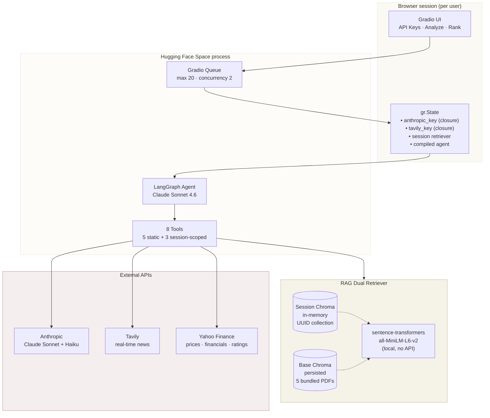
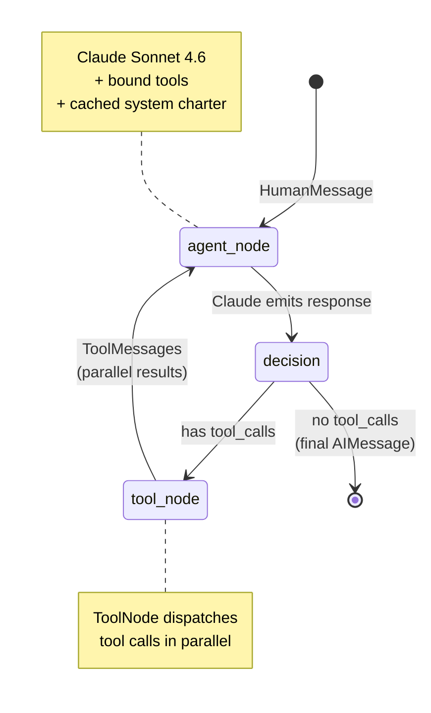
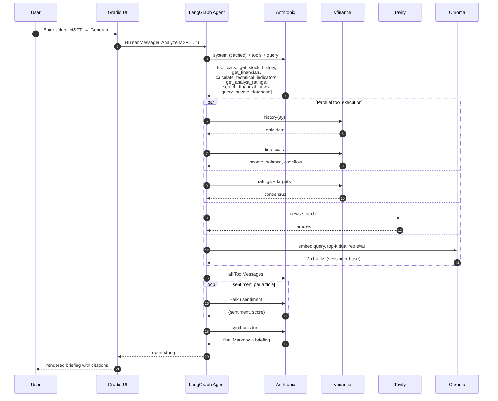
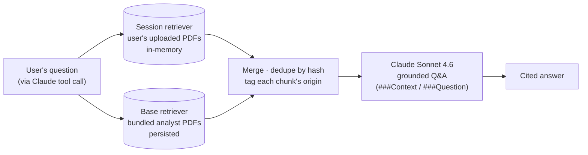

# Autonomous Financial Research Analyst

An autonomous LangGraph agent that produces institutional-grade investment
research briefings on AI-sector companies. Powered by **Claude Sonnet 4.6** and
eight domain tools covering fundamentals, technicals, Wall Street consensus,
real-time news sentiment, and RAG over private analyst reports.

> **Live demo:** https://huggingface.co/spaces/alanvaa/Autonomous_Financial_Analyst
>
> Bring your own Anthropic + Tavily keys — the Space is BYO-key and fully
> per-session isolated, so no one else can see your credentials, your uploaded
> documents, or your queries.

---

## Table of contents

1. [What the agent does](#what-the-agent-does)
2. [How it works](#how-it-works)
3. [Workflow diagrams](#workflow-diagrams)
4. [Tool catalog](#tool-catalog)
5. [Quick start (local)](#quick-start-local)
6. [Public-Space design — BYO-key + per-session isolation](#public-space-design--byo-key--per-session-isolation)
7. [Security & rate limits](#security--rate-limits)
8. [Repository layout](#repository-layout)
9. [Deploying to Hugging Face Spaces](#deploying-to-hugging-face-spaces)
10. [Known pins](#known-pins)
11. [Environment variables](#environment-variables)

---

## What the agent does

Given a **ticker** (or a comma-separated list for ranking), the agent
autonomously gathers and synthesizes:

- **Financial health** — live price + 3-year performance + fundamentals
  (revenue, margins, FCF, P/E, EPS, YoY growth) from Yahoo Finance
- **Technical picture** — RSI(14), MA50, MA200, 52-week high/low, golden/death
  cross flags
- **Wall Street consensus** — strong-buy / buy / hold / sell / strong-sell
  counts plus mean/high/low price targets
- **Market sentiment** — real-time news via Tavily, each article scored by
  Claude Haiku 4.5
- **AI research activity** — RAG over a **hybrid corpus**:
  - *Your* uploaded PDFs (per-session, in-memory, isolated)
  - *Bundled* analyst reports on AMZN · GOOGL · IBM · MSFT · NVDA
- **Risk assessment** — 2-3 proactively identified risks
- **Recommendation** — Buy / Hold / Sell with a confidence level and full
  source citations

The output is a Markdown briefing suitable for a portfolio meeting: every
factual claim is cited back to the tool that produced it (with timestamps for
prices and URLs for news articles).

**Three modes** are exposed in the UI:

1. **Single-company deep dive** — one ticker, full briefing
2. **Multi-company ranking** — up to 8 tickers ranked with a comparative table
3. **Private document augmentation** — optionally upload your own PDFs to feed
   the RAG tool for this session only

---

## How it works

The agent is a **single LangGraph state machine** with tool-calling. A single
`agent_node` running **Claude Sonnet 4.6** is given all eight tools and
iterates until it decides it has enough data to produce a final answer.

**Key design choices:**

- **Prompt caching** on the 3k-token system charter (`cache_control: ephemeral`)
  — cuts token cost ~90% after the first turn of the agent loop.
- **Parallel tool calls** — Claude emits multiple tool-call instructions per
  turn. The LangGraph `ToolNode` dispatches them concurrently, so a
  full briefing (5-7 tool calls) completes in ~2 round-trips instead of ~7.
- **Hybrid RAG** — the `query_private_database` tool hits both a
  session-scoped in-memory Chroma (user's uploads) and a shared persisted base
  corpus, deduplicates by content hash, and tags each result's origin.
- **Local embeddings** — `sentence-transformers/all-MiniLM-L6-v2` runs on the
  Space's CPU, so RAG works without any embedding API key or cost.
- **Per-session isolation** — every Gradio session gets its own freshly-built
  agent whose tools close over that user's API keys. Keys never touch
  `os.environ`, so they can't leak across browser sessions sharing the process.
- **Rate limiting** — sliding windows per session (`analyze`: 3/min · 8/5min ·
  30/hr; `rank`: 2/min · 5/5min · 15/hr; `upload`: 3/5min · 10/hr) plus
  Gradio-level queue backpressure (`max_size=20, concurrency=2`).

---

## Workflow diagrams

### System architecture



### Agent loop (LangGraph state machine)



### Request lifecycle (single briefing)



### RAG dual-retriever merge



---

## Tool catalog

Eight tools in two families:

| Family | Tool | Source | API key required |
|---|---|---|---|
| **Static** (module-level, shared safely) | `get_stock_price` | yfinance | — |
| | `get_stock_history` | yfinance | — |
| | `get_analyst_ratings` | yfinance | — |
| | `get_financials` | yfinance | — |
| | `calculate_technical_indicators` | yfinance + pandas | — |
| **Session-scoped** (rebuilt per session, keys via closure) | `search_financial_news` | Tavily | Tavily |
| | `analyze_sentiment` | Claude Haiku 4.5 | Anthropic |
| | `query_private_database` | dual Chroma + Claude Sonnet 4.6 | Anthropic |

**Split rationale:** yfinance doesn't need any user keys, so those tools can be
defined once at module level and shared across all sessions. The three tools
that do need keys are built inside `build_session_tools(...)` so they close
over the current session's keys + retriever without ever writing them to
`os.environ`.

---

## Quick start (local)

### Windows

```bash
# 1. Clone
git clone https://github.com/alanvaa06/Autonomous_Financial_Analyst.git
cd Autonomous_Financial_Analyst

# 2. Create a Python 3.12 venv (required — see "Known pins")
py -3.12 -m venv .venv

# 3. Install dependencies (~1-2 GB, a few minutes)
.venv/Scripts/python.exe -m pip install -r requirements.txt

# 4. Run
.venv/Scripts/python.exe app.py
```

### macOS / Linux

```bash
git clone https://github.com/alanvaa06/Autonomous_Financial_Analyst.git
cd Autonomous_Financial_Analyst
python3.12 -m venv .venv
source .venv/bin/activate
pip install -r requirements.txt
python app.py
```

Open **http://127.0.0.1:7860** and paste your API keys in the **API Keys** tab.

### Getting API keys

1. **Anthropic** — https://console.anthropic.com/settings/keys (you pay for
   your own Claude usage)
2. **Tavily** — https://tavily.com (free tier covers casual use)

---

## Public-Space design — BYO-key + per-session isolation

Running this as a *public* Hugging Face Space means many users share a single
Python process. A few design invariants keep them cleanly isolated:

| Concern | Mitigation |
|---|---|
| API-key leakage across users | Keys live ONLY in the tools' closures. **Never** `os.environ`. Verified in the audit. |
| Document leakage across users | Uploads go into a fresh in-memory Chroma collection with a UUID name (`session_{uuid}`). No `persist_directory`. Auto-GC'd when the session ends. |
| Owner's wallet exposure | Env-var keys are **ignored** unless `ALLOW_ENV_KEYS=1`. Each visitor pastes their own. |
| Abuse via huge uploads | ≤ 25 MB per PDF, ≤ 10 PDFs per session, encrypted/unreadable PDFs skipped. |
| One user monopolizing the process | Per-session sliding-window rate limits + Gradio-level queue cap (`max_size=20`, `concurrency=2`). |

---

## Security & rate limits

**Audit checklist (all ✅):**

- No hardcoded secrets in committed files (only placeholders in `.env.example`)
- No writes to `os.environ` for user-supplied keys
- All API keys flow via `ChatAnthropic(anthropic_api_key=...)` and
  `TavilySearchResults(tavily_api_key=...)` kwargs
- `config.json`, `.env`, `.venv/`, `__pycache__/` all gitignored
- PDF upload: type check + size limit + count limit + encryption check

**Rate limits (sliding windows, per session):**

| Action | 1 min | 5 min | 1 hr |
|---|---|---|---|
| `analyze` | 3 | 8 | 30 |
| `rank` | 2 | 5 | 15 |
| `upload` | — | 3 | 10 |

Plus **Gradio queue** limits: `max_size=20` enqueued, `default_concurrency_limit=2`
concurrent jobs.

---

## Repository layout

```
.
├── app.py             # Gradio Blocks UI — gr.State for per-session isolation
├── agent.py           # build_agent_for_session(keys, retriever) factory
├── tools.py           # 5 static tools + build_session_tools factory
├── rag.py             # base (persisted) + session (in-memory) retrievers
├── ratelimit.py       # sliding-window per-session rate limiter
├── requirements.txt   # pinned (see "Known pins" below)
├── README.md          # this file (also the HF Space card)
├── .env.example       # local-dev env var template
├── .gitignore
├── .claude/
│   └── launch.json    # dev-server config for Claude Code users
└── data/
    ├── README.md
    └── Companies-AI-Initiatives/
        ├── AMZN.pdf
        ├── GOOGL.pdf
        ├── IBM.pdf
        ├── MSFT.pdf
        └── NVDA.pdf
```

The base-corpus PDFs are bundled in the repo. First run builds a persisted
Chroma index at `data/chroma_index/` (gitignored); subsequent starts reuse it
via a content-hash manifest that auto-invalidates if you add/remove PDFs.

---

## Deploying to Hugging Face Spaces

### Public Space (the default, recommended for this design)

```bash
# One-time: install the hf CLI and authenticate
pip install -U "huggingface_hub[cli]"
hf auth login                                     # paste write token

# Create the Space
hf repo create <you>/<space-name> --type space --space-sdk gradio

# Upload the repo contents via the Hub API (handles binary files cleanly —
# unlike plain git push, which HF rejects for binaries)
hf upload <you>/<space-name> . --repo-type=space \
    --exclude ".git/**" --exclude ".venv/**" \
    --exclude "__pycache__/**" --exclude "data/chroma_index/**"
```

**Do NOT** set `ANTHROPIC_API_KEY` or `TAVILY_API_KEY` as Space Secrets — that
would bill every visitor against your key. Leave them unset so the BYO-key UI
takes over. Also leave `ALLOW_ENV_KEYS` unset.

### Private / team Space

If only trusted users will use the Space, you *can* pre-fill keys:

1. Set `ANTHROPIC_API_KEY` and `TAVILY_API_KEY` as Space Secrets.
2. Set `ALLOW_ENV_KEYS=1` as a Space Variable.

The app auto-builds the agent on session start; the form still works as an
override.

---

## Known pins

This stack has a few tight version constraints driven by ecosystem churn:

| Package | Pin | Why |
|---|---|---|
| Python | **3.12** | pydantic v1 shims used by LangChain 0.3 break on 3.14+; pydub (via gradio) breaks on 3.13 (`audioop` removed from stdlib) |
| `gradio` | `==4.44.1` | locks `gradio-client 1.3.0` |
| `fastapi` | `>=0.110,<0.113` | starlette 0.38+ changed `TemplateResponse` signature (breaks gradio 4.44) |
| `starlette` | `>=0.37,<0.38` | same |
| `huggingface_hub` | `<1.0` | 1.x removed `HfFolder` (still imported by gradio 4.44) |
| `transformers` | `<5.0` | 5.x requires `huggingface_hub >= 1.5`, conflicts with the gradio pin |
| `yfinance` | `>=0.2.40,<0.2.50` | ≥ 0.2.50 requires `websockets >= 13`, conflicts with `gradio-client 1.3` |

Plus a monkey-patch at the top of `app.py` to work around a `gradio_client 1.3.0`
bug where `_json_schema_to_python_type(True)` (the `additionalProperties: True`
case from `gr.File` + `gr.State` introspection) crashes with
`TypeError: argument of type 'bool' is not iterable`.

---

## Environment variables

See [`.env.example`](./.env.example). All are optional:

| Variable | Purpose |
|---|---|
| `ANTHROPIC_API_KEY` | Only read if `ALLOW_ENV_KEYS=1` (local dev). |
| `TAVILY_API_KEY` | Same. |
| `ALLOW_ENV_KEYS` | `1` to enable env-var bootstrap. **Unset on public Spaces.** |
| `PDF_DIR` | Override the base-corpus PDF folder (default: `data/Companies-AI-Initiatives/`). |

---

## Acknowledgments

- Built from the JHU Week 10 "Autonomous Financial Research Analyst" notebook
  (LangGraph + RAG assignment), extended for institutional-grade output and
  public multi-user deployment.
- Base corpus: 5 publicly-sourced AI-initiative analyst reports bundled in
  `data/Companies-AI-Initiatives/`.

## License

MIT — see frontmatter.
